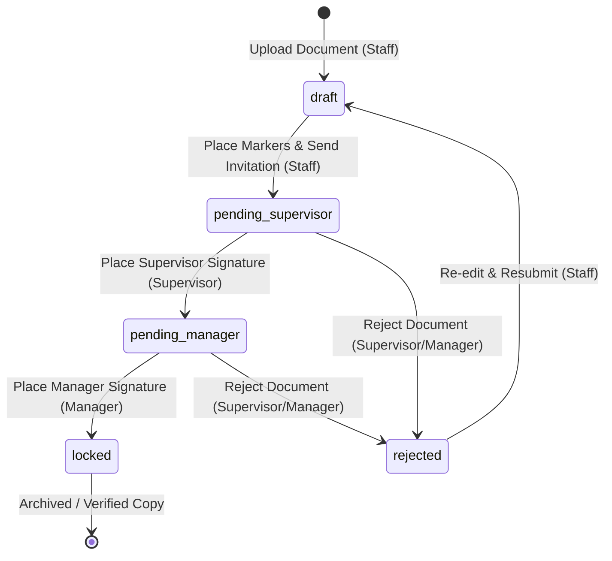

# Digital Sign Application - Document Workflow Specification

This document details the document signing lifecycle, roles, and status transitions implemented in the codebase of the Digital Sign Application.

---

## 1. Workflow State Machine

The document transitions through four distinct statuses from initial upload to completion:

---

## 2. Roles & Permissions Matrix

| Role | Allowed Actions | Authorized Document States |
| :--- | :--- | :--- |
| **Staff** (`user`) | • Upload PDF • Place signature/date/text markers • Send invitation | `draft`, `rejected` |
| **Supervisor** (`supervisor`) | • Review document • Draw/apply signature on assigned markers • Reject document | `pending_supervisor` |
| **Manager** (`manager`) | • Review document • Draw/apply signature on assigned markers • Reject document | `pending_manager` |

---

## 3. Workflow Phase Details

### Phase 1: Draft & Setup (`draft` / `rejected`)
- **Trigger**: Created via `POST /api/documents/upload`.
- **UI View**: [DocumentEditor.tsx](file:///c:/Users/richi/.gemini/antigravity-ide/scratch/digital-sign-app/frontend/src/pages/DocumentEditor.tsx) renders sidebar controls allowing the **Staff** member to drag signature fields, assign them to a specific supervisor/manager, and place them on PDF coordinates.
- **Audit Logs**: Generates `DOCUMENT_CREATED` upon initial file upload.

### Phase 2: Pending Supervisor Review (`pending_supervisor`)
- **Trigger**: Staff clicks "Next: Add Recipients" and confirms invitation in `InviteModal.tsx`.
- **Transitions**: 
  - Status updates to `pending_supervisor`.
  - Audit logs appended with `SIGNATURE_MARKERS_PLACED` and `SIGNING_INVITATION_SENT`.
- **UI View**: The document is locked for Staff editing. When the **Supervisor** logs in, they are prompted to click the signature box and apply their signature drawing.

### Phase 3: Pending Manager Review (`pending_manager`)
- **Trigger**: Supervisor applies signature to their designated box.
- **Transitions**: 
  - Status updates to `pending_manager`.
  - Audit logs appended with `DOCUMENT_SIGNED` containing the signature metadata (timestamp, IP, hash, certificate ID).
- **UI View**: When the **Manager** logs in, they see the supervisor's signature and can click their own assigned box to sign.

### Phase 4: Completed & Locked (`locked`)
- **Trigger**: Manager applies final signature to the document.
- **Transitions**: 
  - Status updates to `locked`.
  - Audit logs appended with final `DOCUMENT_SIGNED` and `DOCUMENT_LOCKED`.
- **UI View**: The document is fully completed. All parties can view the signed document with overlaid visual signatures and review the complete cryptographic audit trail on [DocumentComplete.tsx](file:///c:/Users/richi/.gemini/antigravity-ide/scratch/digital-sign-app/frontend/src/pages/DocumentComplete.tsx).

---

## 4. Cryptographic Integrity & Audit Fields

Every signature applied is verified against the initial document baseline hash to prevent tempering:
- **Baseline Hash**: SHA-256 hash of the original uploaded PDF.
- **Certificate ID**: Unique cert sequence (e.g. `CERT-SUPERVISOR-2026-1234`) generated for each signature.
- **Signature Metadata**: Stored with the marker record, tracking:
  - Signer ID & Email
  - Signing Timestamp
  - Client IP Address
  - Hash Alg (SHA-256)
